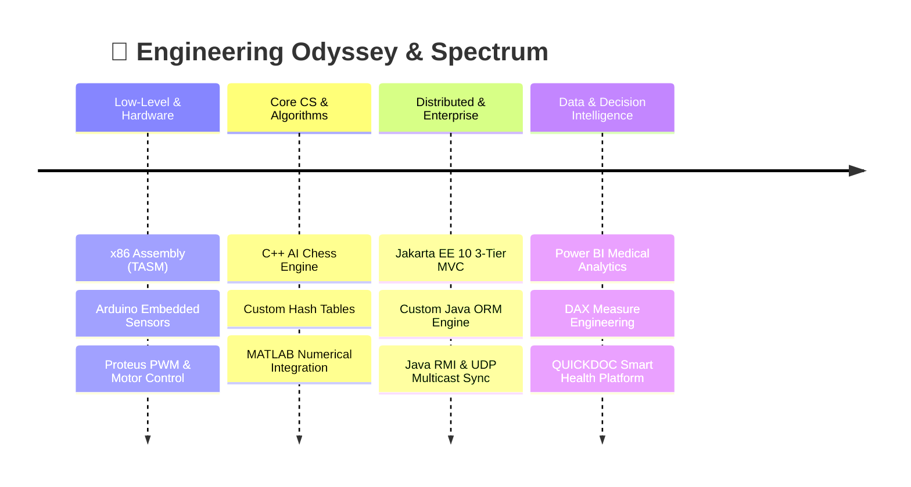

<div align="center">

  <!-- Animated Header Banner -->
  

  <br>

  <!-- Typing SVG Dynamic Tagline -->
  <a href="https://git.io/typing-svg">
    
  </a>

  <br><br>

  <!-- Social & Connect Pills -->
  <p align="center">
    <a href="https://www.linkedin.com/in/aya-moutaouakil-0b8b9a280" target="_blank">
      
    </a>
    &nbsp;
    <a href="mailto:aya.mtkl.5@gmail.com">
      
    </a>
    &nbsp;
    <a href="https://github.com/MOUTAOUAKIL-Aya">
      
    </a>
  </p>

</div>

---

### 🌌 The Developer Spectrum : *From Silicon to Intelligence*

I view software engineering as a continuous spectrum — understanding how a single bit transitions from bare-metal electronics and memory registers up to distributed enterprise clouds and executive decision dashboards.



---

### 🎨 Thematic Project Showcases

<br>

<details open>
<summary><h3>🏥 1. Health-Tech & Decision Intelligence (Power BI, DAX & Healthcare)</h3></summary>

> *Bridging hospital administrative data, clinical pathology insights, and interactive business intelligence.*

| Project | Highlights & Tech Stack | Link |
| :--- | :--- | :---: |
| **University Hospital BI (CHU Fès)** | Multi-criteria dashboard tracking clinical research, scientific publications, and departmental validation workflows. Modeled with complex DAX measures. | [**Explore** ➜](https://github.com/MOUTAOUAKIL-Aya/university-hospital-analytics-powerbi) |
| **Healthcare Clinic Operations BI** | Complete financial and patient journey dashboard: revenue recovery, doctor workload, patient loyalty index, and specialty analytics. | [**Explore** ➜](https://github.com/MOUTAOUAKIL-Aya/healthcare-clinic-analytics-powerbi) |
| **QUICKDOC Platform** | Smart digital healthcare web application streamlining medical appointments and patient records. | [**Explore** ➜](https://github.com/MOUTAOUAKIL-Aya/QUICKDOC) |
| **Employee Sales Analytics** | Statistical data pipeline processing corporate sales figures through MySQL with Python charts. | [**Explore** ➜](https://github.com/MOUTAOUAKIL-Aya/employee_sales_analyses) |

</details>

<br>

<details open>
<summary><h3>☕ 2. Enterprise Backend & Distributed Systems (Java, Jakarta EE, RMI)</h3></summary>

> *Architecting scalable, decoupled systems with zero-compromise design patterns.*

| Project | Highlights & Tech Stack | Link |
| :--- | :--- | :---: |
| **Student Attendance Management** | 3-Tier MVC web app built on **Jakarta EE 10** featuring a **custom-built ORM engine**, decoupled DAO pattern, and MySQL connection safety. | [**Explore** ➜](https://github.com/MOUTAOUAKIL-Aya/student-attendance-management-jakarta-ee) |
| **Distributed Systems & Networking** | Real-time **WYSIWIS** shared text editor via **Java RMI callbacks**, low-latency **UDP Multicast** canvas drawing, and multi-threaded TCP/UDP sockets. | [**Explore** ➜](https://github.com/MOUTAOUAKIL-Aya/java-distributed-systems-rmi-sockets) |

</details>

<br>

<details open>
<summary><h3>🧠 3. Algorithms, AI & Computational Mathematics (C++, Python, MATLAB)</h3></summary>

> *Mastering algorithmic complexity, discrete mathematics, and game theory.*

| Project | Highlights & Tech Stack | Link |
| :--- | :--- | :---: |
| **C++ Chess Engine** | Full-featured console Chess game supporting Player vs. AI, move validation, piece kinematics, and checkmate detection. | [**Explore** ➜](https://github.com/MOUTAOUAKIL-Aya/chess_game) |
| **Hash Table Collision Engine** | C++ benchmarking engine generating pseudo-random keys, evaluating 3 distinct hashing algorithms and visualizing bucket distributions. | [**Explore** ➜](https://github.com/MOUTAOUAKIL-Aya/Hash_Table_implementation) |
| **Composite Simpson Quadrature** | MATLAB implementation approximating definite integrals with theoretical error bounds via 4th derivative analysis. | [**Explore** ➜](https://github.com/MOUTAOUAKIL-Aya/Composite_Simpson) |
| **Python Nim Game with AI** | Mathematical strategy game featuring AI decision heuristics, persistent MySQL score tracking, and Matplotlib data analytics. | [**Explore** ➜](https://github.com/MOUTAOUAKIL-Aya/Nim_game) |
| **Matrix Linear Algebra Engine** | Interactive C++ matrix manipulation tool (matrix products, sums, transpositions, and powers). | [**Explore** ➜](https://github.com/MOUTAOUAKIL-Aya/MatrixSumAndProduct) |

</details>

<br>

<details open>
<summary><h3>🔌 4. Embedded Systems & Low-Level Assembly (IoT, Arduino, TASM)</h3></summary>

> *Interacting directly with silicon, registers, and electronic actuators.*

| Project | Highlights & Tech Stack | Link |
| :--- | :--- | :---: |
| **Moving Avatar in Assembly (TASM)** | Pixel-level DOS GUI animation written in pure 16-bit x86 Assembly manipulating VGA memory registers directly. | [**Explore** ➜](https://github.com/MOUTAOUAKIL-Aya/avatar_moving) |
| **Arduino Motor Speed & Direction** | Hardware PWM speed regulation with potentiometers and H-bridge direction control (simulated in Proteus). | [**Explore** ➜](https://github.com/MOUTAOUAKIL-Aya/arduino_motor_speed) |
| **Temperature Sensor & LCD Display** | Analog sensor acquisition (LM35) with real-time temperature conversion displayed on 16x2 LCD. | [**Explore** ➜](https://github.com/MOUTAOUAKIL-Aya/arduino_temperature_display_lcd) |
| **7-Segment Binary Counter** | Binary-to-decimal decoding logic driving a physical 7-segment display module. | [**Explore** ➜](https://github.com/MOUTAOUAKIL-Aya/Arduino-7-Segment-Binary-Counter) |

</details>

---

### 🛠️ Interactive Tech Arsenal

<div align="center">

```
   DATA & BI       BACKEND & CLOUD     LANGUAGES & CORE      SYSTEMS & TOOLS
 ─────────────    ─────────────────   ──────────────────    ─────────────────
  Power BI         Jakarta EE 10       Java (17+)            Docker
  DAX Modeling     Spring Boot         C / C++               Git & GitHub
  MySQL            Node.js / Express   Python                Linux (Debian/RHEL)
  Data Warehouses  RESTful APIs        x86 Assembly (TASM)   Maven
  Python Analytics Custom ORM Engine   MATLAB                Proteus Simulation
```

<br>

<p align="center">
  
  
  
  
  
  
  
</p>

</div>

---

<div align="center">

  

  <p><b>✨ Designed with passion & precision • Aya MOUTAOUAKIL • 2026 ✨</b></p>
  <p><i>Open to exciting opportunities in Software Engineering, Data Architecture & Health-Tech</i></p>

</div>
