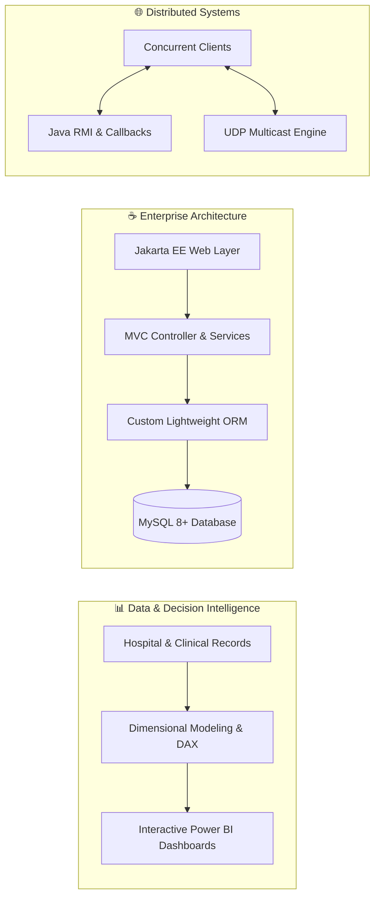

  # 👋 Hi there, I'm Aya MOUTAOUAKIL
  
  

  

    <b>🎓 Software Engineering & Data Analytics Student @ ESISA</b> 
    Passionate about architecting enterprise software, engineering data models, and designing intuitive decision-making dashboards.
  

  

    
    
    
  

---

### 🚀 About Me

- 💻 Passionate about **Software Architecture**, **Enterprise Java**, and **Data Intelligence**.
- 📊 Experienced in designing end-to-end **Power BI dashboards**, **DAX modeling**, and medical analytics.
- 🌐 Experienced with **Distributed Systems**, **RMI / Multicast protocols**, and real-time collaboration tools.
- 🎯 Always looking for innovative challenges in Data Engineering, AI, and Full-Stack development.

---

### 🛠️ Tech Stack & Skills

| Domain | Technologies & Frameworks |
| :--- | :--- |
| **Data & Business Intelligence** |      |
| **Backend & Architecture** |      |
| **Frontend & Web** |     |
| **DevOps, Systems & Tools** |     |

---

### 🌟 Featured Projects

<table>
  <tr>
    <td width="50%" valign="top">
      <h3 align="center">🏥 University Hospital BI Analytics</h3>
      

        
      

      
Interactive Power BI solution analyzing clinical research, scientific publications, and departmental validation tracking in university hospital environments (CHU Fès collaboration).

      
<b>Tech:</b> Power BI, DAX, Data Modeling, Healthcare Analytics

    </td>
    <td width="50%" valign="top">
      <h3 align="center">🩺 Healthcare & Clinic Operations BI</h3>
      

        
      

      
End-to-end clinical management dashboard tracking patient consultations, revenue performance, specialty breakdowns, and care quality indices.

      
<b>Tech:</b> Power BI Desktop, DAX Measures, Financial KPI Tracking

    </td>
  </tr>
  <tr>
    <td width="50%" valign="top">
      <h3 align="center">🎓 Student Attendance System (Jakarta EE)</h3>
      

        
      

      
Enterprise Java web application with 3-tier MVC architecture, DAO persistence, service layer, and a custom lightweight ORM engine.

      
<b>Tech:</b> Java 17, Jakarta EE 10, Servlets/JSP, MySQL, Custom ORM, Maven

    </td>
    <td width="50%" valign="top">
      <h3 align="center">🌐 Distributed Systems & Networking</h3>
      

        
      

      
Distributed collaborative systems featuring real-time WYSIWIS shared text editor via RMI with client callbacks, UDP Multicast canvas drawing, and TCP/UDP sockets.

      
<b>Tech:</b> Java RMI, Multicast UDP, Sockets, Asynchronous Callbacks, Concurrency

    </td>
  </tr>
</table>

---

### 🏆 Engineering Highlights & Technical Competencies

| 📊 Decision Intelligence & Data Modeling | ☕ Enterprise Backend & Software Design | 🌐 Distributed Systems & Networking |
| :--- | :--- | :--- |
| • **Healthcare BI Analytics:** Production-grade dashboards for University Hospitals (CHU Fès) and private clinic networks. • **Advanced DAX Formulas:** Calculated KPIs for revenue recovery, doctor workload, patient recurrence, and research validation. • **Multi-Source Ingestion:** Relational schema design, dimensional modeling, and interactive reporting views. | • **Custom ORM Development:** Engineered a dynamic Object-Relational Mapping engine in pure Java to bridge SQL and entities. • **3-Tier Decoupled MVC:** Implementation of strict Front-Controller, Service Layer, and DAO design patterns. • **Jakarta EE 10:** Robust Servlets, JSP templates, connection pooling, and resilient MySQL 8+ integration. | • **Asynchronous RMI Callbacks:** Zero-polling collaborative architectures with real-time state synchronization (WYSIWIS). • **UDP Multicast Protocol:** Concurrent multi-client canvas drawing across Class D multicast groups. • **Socket Engineering:** Low-level TCP stream servers and UDP datagram sockets with multi-threading and loop protection. |

 

---

  
<i>⭐️ Feel free to explore my repositories, open an issue, or connect for future collaborations!</i>

