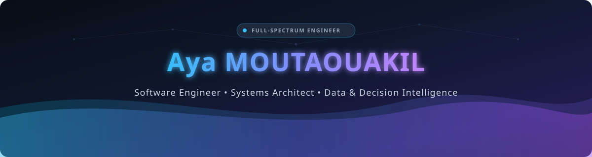
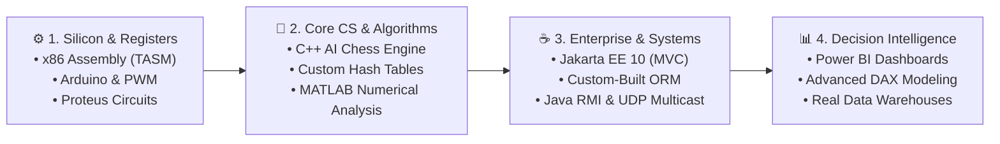

<div align="center">

  <!-- Sleek Cosmic Cyber Wave Banner -->
  

  <br>

  <!-- Interactive Terminal-Style Typing Tagline -->
  <a href="https://git.io/typing-svg">
    
  </a>

  <br><br>

  <!-- Direct Connection Badges -->
  <p align="center">
    <a href="https://www.linkedin.com/in/aya-moutaouakil-0b8b9a280" target="_blank">
      
    </a>
    &nbsp;
    <a href="mailto:aya.mtkl.5@gmail.com">
      
    </a>
    &nbsp;
    <a href="https://github.com/MOUTAOUAKIL-Aya">
      
    </a>
  </p>

</div>

---

### 💻 `whoami --verbose`

```bash
╭─ aya@workstation ~
╰─$ cat profile.json
{
  "name": "Aya MOUTAOUAKIL",
  "title": "Software Engineer & Decision Intelligence Architect",
  "education": "ESISA (École Supérieure d'Ingénierie en Sciences Appliquées)",
  "core_philosophy": "Master the machine from the transistor register up to the executive dashboard.",
  "strengths": [
    "Building custom architectural engines (custom ORMs, MVC front-controllers)",
    "Distributed computing & zero-polling asynchronous protocols (RMI, Multicast)",
    "High-impact data modeling & multi-criteria DAX decision analytics",
    "Algorithmic precision (AI Chess engines, numerical integration, hashing analysis)"
  ],
  "current_status": "Ready for high-impact software engineering & data architecture challenges"
}
```

---

### ⚡ The Full-Spectrum Engineering Blueprint

> *Most developers stay in a single abstraction layer. I choose to master the entire stack — understanding how CPU registers, network sockets, enterprise backends, and decision models interact seamlessly.*



---

### 🏆 Curated Project Showcase

<br>

<details open>
<summary><h3>📊 1. Decision Intelligence, Data Modeling & Business Analytics</h3></summary>

> *Transforming real-world complex data into actionable executive insights with custom metrics and dimensional modeling.*

| Project | Deep Dive & Technical Scope | Repository |
| :--- | :--- | :---: |
| **Enterprise Academic Analytics** | Large-scale institutional reporting tracking research productivity, multi-departmental validation funnels, and personnel performance using complex DAX measures. | [**View Repository** ➜](https://github.com/MOUTAOUAKIL-Aya/university-hospital-analytics-powerbi) |
| **Operational & Financial Analytics** | End-to-end organizational dashboard: financial cash-flow tracking, capacity utilization, workload distribution, and retention indices. | [**View Repository** ➜](https://github.com/MOUTAOUAKIL-Aya/healthcare-clinic-analytics-powerbi) |
| **Corporate Sales & Performance Data Pipeline** | Automated Python pipeline extracting, normalizing, and analyzing corporate sales records through MySQL with dynamic statistical distributions. | [**View Repository** ➜](https://github.com/MOUTAOUAKIL-Aya/employee_sales_analyses) |
| **QUICKDOC Digital Platform** | Digital service ecosystem optimizing user appointments, operational scheduling, and structured data handling. | [**View Repository** ➜](https://github.com/MOUTAOUAKIL-Aya/QUICKDOC) |

</details>

<br>

<details open>
<summary><h3>☕ 2. Enterprise Architecture, Custom Engines & Distributed Systems</h3></summary>

> *Engineering from first principles: writing custom ORMs and network protocols rather than relying solely on black-box frameworks.*

| Project | Deep Dive & Technical Scope | Repository |
| :--- | :--- | :---: |
| **Modular Attendance Management (Jakarta EE)** | Enterprise 3-tier system built on **Jakarta EE 10**. Features a **custom-engineered lightweight ORM** that dynamically generates SQL queries and maps result matrices to Java entities without external dependencies. | [**View Repository** ➜](https://github.com/MOUTAOUAKIL-Aya/student-attendance-management-jakarta-ee) |
| **Distributed Systems & Networking Protocols** | Real-time **WYSIWIS** (What You See Is What I See) collaborative editor using **Java RMI with asynchronous client callbacks**, plus a zero-latency **UDP Multicast** canvas synchronizer. | [**View Repository** ➜](https://github.com/MOUTAOUAKIL-Aya/java-distributed-systems-rmi-sockets) |

</details>

<br>

<details open>
<summary><h3>🧠 3. Computational Mathematics, Algorithmic Engines & AI</h3></summary>

> *Tackling algorithmic complexity, discrete mathematics, and game theory.*

| Project | Deep Dive & Technical Scope | Repository |
| :--- | :--- | :---: |
| **Console Chess Engine with AI** | Full C++ Chess implementation supporting Player vs. AI, piece kinematic rules, board validation matrices, and checkmate detection. | [**View Repository** ➜](https://github.com/MOUTAOUAKIL-Aya/chess_game) |
| **Hash Table Collision Benchmarking** | C++ performance analyzer generating pseudo-random key distributions, evaluating 3 distinct hashing algorithms and visualizing bucket collisions. | [**View Repository** ➜](https://github.com/MOUTAOUAKIL-Aya/Hash_Table_implementation) |
| **Numerical Quadrature (Composite Simpson)** | MATLAB numerical integration tool approximating definite integrals with rigorous theoretical error bounds via 4th derivative analysis. | [**View Repository** ➜](https://github.com/MOUTAOUAKIL-Aya/Composite_Simpson) |
| **Mathematical Game Theory with AI (Nim)** | Full Python implementation of the game of Nim with minimax-style AI strategies, persistent MySQL game-state logging, and Matplotlib visual analytics. | [**View Repository** ➜](https://github.com/MOUTAOUAKIL-Aya/Nim_game) |
| **Linear Algebra Matrix Processor** | Interactive C++ console utility executing high-dimensional matrix products, powers, sums, and inversions. | [**View Repository** ➜](https://github.com/MOUTAOUAKIL-Aya/MatrixSumAndProduct) |

</details>

<br>

<details open>
<summary><h3>⚡ 4. Low-Level Silicon, Assembly & Hardware Control</h3></summary>

> *Direct memory manipulation, microcontrollers, and electronic signal regulation.*

| Project | Deep Dive & Technical Scope | Repository |
| :--- | :--- | :---: |
| **Pixel-Level Animation in x86 Assembly (TASM)** | 16-bit DOS graphical program manipulating VGA memory registers directly to produce real-time sprite movement without high-level graphics drivers. | [**View Repository** ➜](https://github.com/MOUTAOUAKIL-Aya/avatar_moving) |
| **Arduino PWM Motor Regulation** | Real-time speed and direction controller utilizing pulse-width modulation (PWM), potentiometer sampling, and H-bridge drivers (Proteus simulated). | [**View Repository** ➜](https://github.com/MOUTAOUAKIL-Aya/arduino_motor_speed) |
| **Analog Sensor Acquisition & LCD Display** | Continuous temperature acquisition (LM35) with ADC conversion displayed on a 16x2 LCD module with Arduino Uno. | [**View Repository** ➜](https://github.com/MOUTAOUAKIL-Aya/arduino_temperature_display_lcd) |
| **Digital Logic 7-Segment Counter** | Binary decoding logic directly driving a physical 7-segment display. | [**View Repository** ➜](https://github.com/MOUTAOUAKIL-Aya/Arduino-7-Segment-Binary-Counter) |

</details>

---

### 🛠️ Technical Arsenal

<div align="center">

```
┌──────────────────────────────┬──────────────────────────────┬──────────────────────────────┐
│       DATA & ANALYTICS       │     ENTERPRISE & BACKEND     │     SYSTEMS & LOW-LEVEL      │
├──────────────────────────────┼──────────────────────────────┼──────────────────────────────┤
│  • Power BI Desktop          │  • Java (17 / 21 / 25)       │  • C & C++ (Modern)          │
│  • Advanced DAX Measures     │  • Jakarta EE 10 / Servlets  │  • x86 Assembly (TASM)       │
│  • Star / Snowflake Schemas  │  • Custom ORM Engines        │  • Linux (POSIX / Bash)      │
│  • MySQL / Relational DBs    │  • Spring Boot & Node.js     │  • Arduino & Proteus         │
│  • Python Data Pipelines     │  • Java RMI & UDP Multicast  │  • Git & CI/CD Tooling       │
└──────────────────────────────┴──────────────────────────────┴──────────────────────────────┘
```

<br>

<p align="center">
  
  
  
  
  
  
  
</p>

</div>

---

<div align="center">

  <!-- Sleek Cosmic Footer -->
  

  <p><b>✨ "Simplicity is prerequisite for reliability." — Edsger W. Dijkstra ✨</b></p>
  <p><i>Aya MOUTAOUAKIL • Open for Software Engineering, Distributed Systems & Data Architecture Opportunities</i></p>

</div>
